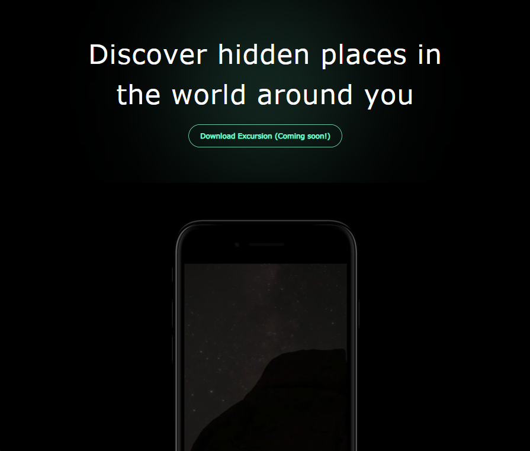

# Excursion Landing Page

---

## 📸 Preview

Excursion is a **travel landing page** designed to promote a fictional mobile app that helps users discover hidden places around them.

The website presents a clean, modern layout with a hero section, promotional video, feature description, and a call-to-action encouraging users to download the app.

---

## 🌐 Live Demo

You can view the project here:

https://amirabenameur3.github.io/excursion/

---

## 🛠 Project Overview

This project focuses on building a **simple product landing page** using HTML and CSS.

The goal was to practice:

- structuring a landing page layout
- embedding and styling video content
- creating responsive sections
- improving typography and spacing
- designing call-to-action buttons

---

## ✨ Features

- Hero section with promotional message
- Embedded autoplay promotional video
- Travel feature section with imagery
- Call-to-action download section
- Clean minimal dark theme
- Responsive layout
- Hover effects and polished styling

---

## 💡 Technologies Used

- HTML5
- CSS3
- Flexbox
- Responsive design
- Google Fonts
- Font Awesome

---

## 📁 Project Structure

excursion
│
├── index.html
│
├── docs
│   └── Excursion_landingpage_preview.png
│
└── ressources
    ├── css
    │   └── index.css
    │
    ├── images
    │   ├── camp.jpg
    │   ├── excursion.png
    │   ├── excursion_redline.png
    │   └── phone.png
    │
    └── videos
        └── excursion.mp4

---

## 🧠 What I Learned

While building this project I practiced:

- structuring landing pages with semantic HTML
- styling layouts with Flexbox
- embedding and controlling video elements
- improving UI design with spacing and typography
- building responsive sections for different screen sizes

---

## 🚀 Future Improvements

Possible improvements for the project:

- add a navigation bar
- improve animations and transitions
- add scroll-based effects
- enhance the mobile layout
- add JavaScript interactions

---

## 👩‍💻 Author

PhD researcher & Front-End development learner

GitHub  
https://github.com/amirabenameur3

